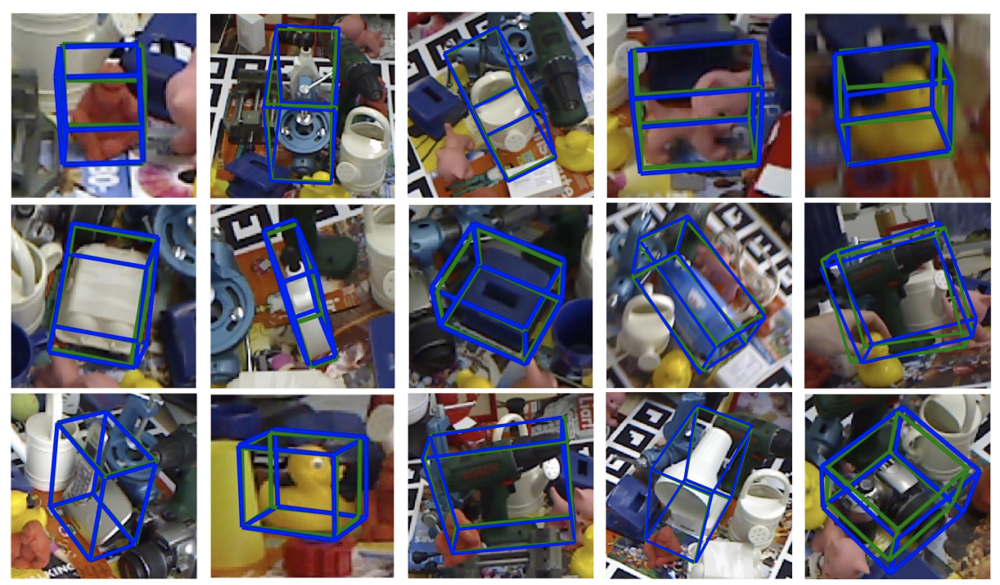

# Problem Statement
To track [autorally](https://arxiv.org/pdf/1806.00678.pdf) vehicle pose (position & orientation) and twist (linear and angular velocity) in 3D of a leading vehicle from the on-board camera of a chasing vehicle. The system will be fed a sequence of images from a monocular camera, and the output will be a real-time estimate of the leading vehicle's pose and twist relative to the chasing vehicle. The estimated poses will be used in a multiagent scenario where inter-vehicle communication is not allowed but knowledge of the relative motion is essential.

    
  Video demonstrating a single autorally vehicle operating around a track at verious velocities.

---

# Approach

## Technical Approach

The first step in our approach is to apply the pose estimation algorithm desribed in [Real-Time Seamless Single Shot 6D Object Pose Prediction](https://arxiv.org/pdf/1711.08848.pdf). This algorithm extends the [YOLO](https://arxiv.org/pdf/1506.02640.pdf) (You Only Look Once) state-of-the-art object detection architecture to predict pose in the camera frame.

The aforementioned framework is limited to detecting object poses in a single frame. As such, useful application of this framework to autorally requires significant enhancement. First, keeping track of multiple vehicles through time is necessary when estimating the vehicle's reward functions. Additionally, obtaining a robust estimate of the lead vehicles' velocity and acceleration is required to predict their future motion.

Visual tracking of multiple vehicles can be achieved via a range of technqiues, including but not limited to [VOT](http://www.votchallenge.net/), [TLD](https://www.learnopencv.com/object-tracking-using-opencv-cpp-python/), [GOTURN](http://davheld.github.io/GOTURN/GOTURN.html), etc. Our aim is to explore the space of object tracking and apply the technique which best fits our needs.

Accurately estimating the linear/angular velocity and linear acceleration of the lead vehicles will require the application of filtering techniques, to ensure that the estimates are robust to noise. 

    
  Figure 1: Sample outputs from the 6D pose estimation algorithm.

At a high level, the system's API would behave as follows:

**Inputs:**
  * A real-time stream of camera images obtained from a monocular camera onboard a chasing autorally vehicle containing a variable number of leading vehicles.

**Outputs:**
  * An output for each detected leading vehicle, containing:
    * A unique identifier for the vehicle.
    * The vehicle's XYZ position relative to the camera frame.
    * The vehicle's linear velocity and acceleration relative to the camera frame.
    * The vehicle's angular velocity relative to the camera frame.

## Data Gathering
The data collection process will consist of driving two autorally vehicles on a dirt track, with one vehicle chasing the other. The vehicles will be traveling at a low speed around an oval track. Global state estimates, containing the position and velocity of each vehicle, are gathered continuously via an [extended kalman filter](https://en.wikipedia.org/wiki/Extended_Kalman_filter) (EKF). We will develop an auto labeller that will use these global estimates to generate highly accurate positions of the vehicles in each frame for training.

We will use the Single Shot 6D Object Pose Prediction implementation provided by the paper's authors, the AutoRally platform and core code as provided [here](https://github.com/AutoRally/autorally), and implement an auto-labeler that will provide the data required to train the 6D pose estimation network.

The auto-labeler will produce leading vehicle's bounding box vertices in the camera frame given the global state estimates for multiple vehicles.

We will have to generate our own dataset since there is no large dataset of multiple vehicles driving autonomously on the same track. Our data gathering process will be carried as follows:
1. _Stationary_ tracking of another vehicle in the lab. 
    * Expect velocity and acceleration estimates of 0 m/s and 0m/s^2, respectively.

2. _Stationary_ tracking of another vehicle on the track.
    * Expect velocity and acceleration estimates of 0 m/s and 0m/s^2, respectively.
   
3. Tracking of a vehicle in a straight line at low speeds with constant velocity.
    * Expect velocity and acceleration estimates of 3 m/s and 0m/s^2, respectively.

4. Tracking of a vehicle in a straight line at medium speeds with constant velocity.
    * Expect velocity and acceleration estimates of 6 m/s and 0m/s^2, respectively.
  
5. Tracking of a vehicle in a straight line with constant acceleration.
    * Expect velocity to increase from 0 to 6m/s and acceleration to remain constant at 1m/s^2.
 
6. Tracking of a vehicle in an oval track line at low speeds with constant velocity.
    * Expect velocity and acceleration estimates of 3 m/s and 0m/s^2, respectively.
 
7. Tracking of a vehicle in an oval track line at medium speeds with constant velocity.
    * Expect velocity and acceleration estimates of 6 m/s and 0m/s^2, respectively.

8. Tracking of a vehicle in an oval track with constant acceleration.
    * Expect velocity to increase from 0 to 6m/s and acceleration to remain constant at 1m/s^2.

# Experimental Outcomes
Success for the project is defined by our ability to accurately and reliably estimate the relative pose and twist of the leading vehicle relative to the chasing vehicle as well as track the leading vehicle over time. This would be a useful step towards multi-agent racing on the autorally platform. Uncertainty in our outcomes would be measured by our system's error on a test set generated by the auto-labeler. This error metric will incorporate tracking, pose, and twist estimate errors.

